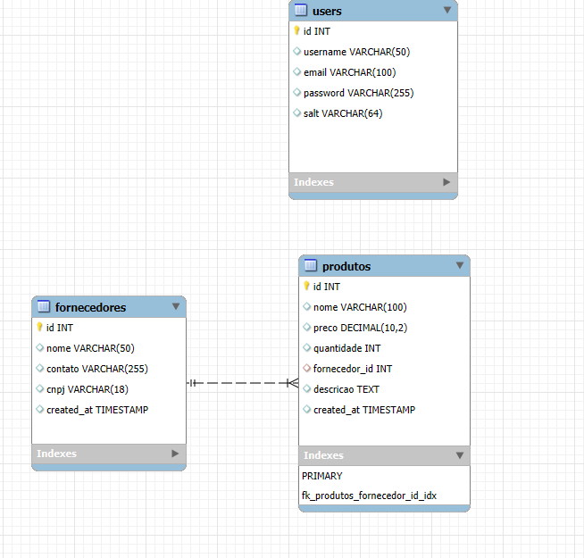

# Mini Sistema de Gestão de Produtos

Este projeto foi desenvolvido como parte da disciplina de Programação para Internet, com o objetivo de criar um sistema de CRUD (Create, Read, Update, Delete) para gerenciamento de produtos e fornecedores. O sistema inclui funcionalidades como cadastro de usuários, criptografia de senhas, autenticação e uma interface para criação e gerenciamento de uma cesta de compras.

## Funcionalidades

- **Criação do Banco de Dados**: O sistema se conecta ao banco de dados gerenciadordb, criando automaticamente as tabelas necessárias. É recomendável utilizar o phpMyAdmin para a configuração inicial.

- **Cadastro de Usuários**: Facilita o cadastramento de fornecedores, abrangendo todas as informações essenciais para o registro de produtos.

- **Cadastro de Fornecedores**:Permite o cadastro de produtos com detalhes como nome, descrição, preço, quantidade e fornecedor relacionado.

- **Cadastro de Produtos**: Inclui o registro de produtos com detalhes como nome, descrição, valor, quantidade e fornecedor associado.

- **Criação de Cesta de Compras**: Os produtos podem ser adicionados a uma cesta de compras por meio de uma interface com caixas de seleção, permitindo que o cliente escolha os itens que deseja adquirir.

- **Atualização Dinâmica da Cesta**: A cesta de compras é atualizada em tempo real usando AJAX, evitando o recarregamento da página e proporcionando uma experiência mais fluida para o usuário.

## Tecnologias Utilizadas

- **Backend PHP**: Linguagem de programação amplamente utilizada para desenvolvimento web, especialmente no lado do servidor
- **Banco de Dados MySQL**: gerenciamento de banco de dados relacional (RDBMS) amplamente utilizado, que permite o armazenamento, organização e recuperação de dados de forma eficiente.
- **Frontend HTML**:Linguagem de marcação padrão usada para criar e estruturar páginas web.
- **CSS Bootstrap**: Framework front-end amplamente utilizado que facilita o desenvolvimento de sites e aplicações web responsivas e móveis.
- **JavaScript (AJAX)**: Usado para interações dinâmicas no frontend, possibilitando atualizações da página sem a necessidade de recarregá-la completamente.

## Figma: https://www.figma.com/design/5hHd2oq02oj0rdbCirXeaz/login?node-id=0-1&node-type=canvas&t=8DYYTWm1yn9KdvnP-0

# Integrantes
Gabriel Pio Machado RA:248812-1
Juliano Siqueira Barbosa RA:249752-1
Iasmim Cabral Gabiatto RA:252561-1